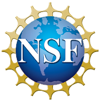

# LiPD Utilities - Python
-----

[](https://zenodo.org/badge/latestdoi/24036/nickmckay/LiPD-utilities)
[]()
[]()
[]()

Input/output and manipulation utilities for LiPD files in Matlab, R and Python.


## What is it?
----

LiPD is short for Linked PaleoData. LiPD is the data standard for paleoclimatology and the exchange of data amongst paleoclimate experts. This package will help you convert your existing database of paleoclimate observations into LiPD files. Moreover, it contains tools to analyze and manipulate LiPD data.

## Features
------

*   Read & write LiPD files
*   Extract & collapse a time series for data analysis
*   Filter & query a time series for subset data
*   Convert Excel files to LiPD files 
*   Convert NOAA files to/from LiPD files
*   Update LiPD publication data through DOI.org 
*   Validate LiPD files through lipd.net API


## Requirements
-------

- [Python 3.4+](https://www.python.org)

- Python IDE (Spyder or PyCharm are highly recommended)

- [pip](https://pip.pypa.io/en/stable/installing/)


## Installation
------------


Python 3.4 / 3.5
```
pip install LiPD
```

Python 3.6+
```
pip3 install --egg LiPD
```


## Usage
----------------

Using your preferred Python IDE or a Python console, you can import the LiPD package using:
```
import lipd
```

Here are the major functions within the package. This is a short preview. More in-depth examples can found further in the guide (coming soon):
```
lipd.readExcel(path="")
lipd.readNoaa(path="")
D = lipd.readLipd(path="")
lipd.writeLipd(D, path="")
ts = lipd.extractTs(D, chron=False)
D = lipd.collapseTs(ts)
idx = lipd.queryTs(ts, expression)
new_ts = lipd.filterTs(ts, expression)
D = lipd.excel()
D = lipd.doi(D)
```


## How to Cite this code
------

  <a href="http://doi.org/10.5281/zenodo.60813"></a>

Use this link to visit the Zenodo website. It provides citation information in many popular formats.


## Further information
----------
Github:
https://github.com/nickmckay/LiPD-utilities

Linked Earth Wiki:
wiki.linked.earth


## Contact
-------

If you are having issues, please let me know.
Contact me at heiser@nau.edu.


## License
-------

The project is licensed under the GNU Public License. Please refer to the file called LICENSE.



